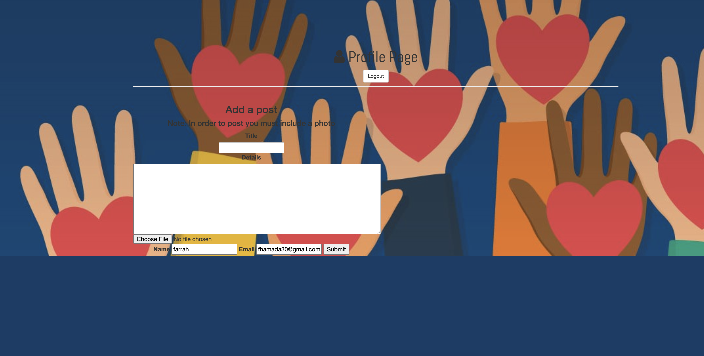

# Neighbor Fullstack
 

  
# Made with:
####  HTML5, CSS3, JavaScript, Node.js, Express, EJS, Mongodb.
# Lesson Learned:
#### I learned how to connect a Mongodb database storing user data. I was able to display the data with EJS HTML. I utilized request's get,post,put and delete.
